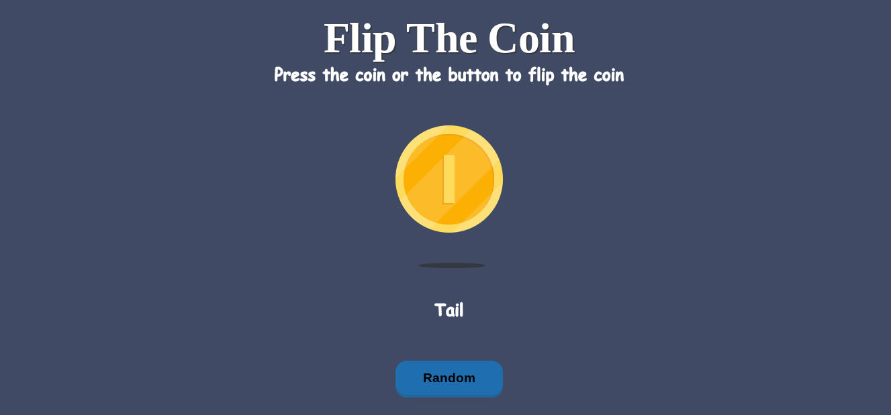

<h1>🪙 Flip The Coin</h1>

  
This is a simple and fun coin-flipping web app made with <strong>HTML</strong>, <strong>CSS</strong>, and <strong>JavaScript</strong>.

  <h2>🌐 Live Demo</h2>
  
Check out the live version here: 
    🔗 <a href="https://your-live-link.netlify.app/" target="_blank">https://your-live-link.netlify.app/</a>
  

  <h2>📸 Screenshot</h2>
  

  <h2>🔧 Features</h2>
  <ul>
    <li>Randomly shows <strong>Heads</strong> or <strong>Tails</strong>.</li>
    <li>Interactive coin with custom images.</li>
  </ul>

  <h2>🚀 How to Run</h2>
  <ol>
    <li>Download or clone this repository.</li>
    <li>Ensure the <code>resources</code> folder contains:
      <ul>
        <li><code>heads.svg</code></li>
        <li><code>tails.svg</code></li>
        <li><code>shadow.svg</code></li>
        <li><code>screenshot.png</code> (for preview)</li>
      </ul>
    </li>
    <li>Open <code>index.html</code> in your browser.</li>
    <li>Click the coin or the button to flip it!</li>
  </ol>

  <h2>📁 File Structure</h2>
  <ul>
    <li><code>index.html</code> – Main HTML file</li>
    <li><code>styles.css</code> – Custom styling</li>
    <li><code>src.js</code> – JavaScript logic</li>
  </ul>

  <h2>📎 GitHub Repository</h2>
  
🔗 <a href="https://github.com/waris24w/Flip-The-Coin" target="_blank">https://github.com/yourusername/flip-the-coin</a>

  <h2>💡 Author</h2>
  
Created by <strong>Waris</strong> 🚀

